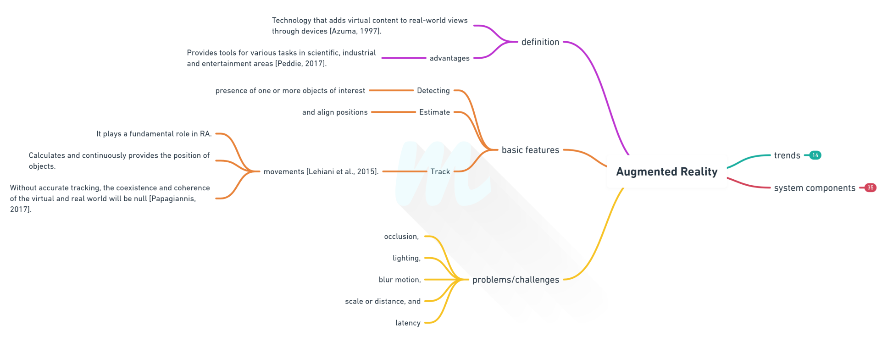

# Augmented Reality 101

The development of areas such as computer vision, image processing, and computer graphics, allow the introduction of technologies such as **Augmented Reality**.

[Azuma](https://www.cs.unc.edu/~azuma/ARpresence.pdf) defines **Augmented Reality** as *"a technology that adds computer-generated virtual content to real-world views through devices"*.

## Introduction

The purpose of these map is to give you an idea about **Augmented Reality** and to guide you through the main features that surround this technology.


### Definition / Basic features / Tendencies



### Advantages / System componentes / Problems


## Augmented Reality Application

 In this repository, I want to present a **basic implementation** that projects on the screen a 3D model aligned (orientation and translation) to a predefined flat surface.

However, currently the industry is investing in different frameworks as [ARCore](https://developers.google.com/ar/discover), [ARKit](https://developer.apple.com/augmented-reality/), and [Vuforia](https://developer.vuforia.com/), among others, which provide the community more accessible technologies with more realistic results and experiences.

The repository has two parts:

1. [Image](src/ar_python3_opencv4.ipynb) is the implementation, step by step, with some basic definitions, to add a 3D model to a flat image.
2. [Video](src/ar_python3_opencv4.py)  is the implementation to have the experience in real-time through a camera.

### Instalation

```
git clone git@github.com:mafda/augmented_reality_101.git
```


### Environment

The tools we will use are Python 3 and OpenCV 4.2.

1. Create virtual environment:

```
python -m venv /path/to/new/virtual/environment
```

2. Activate environment:

```
source /path/to/new/virtual/environment/bin/activate
```

3. Install requirements.txt file:

```
pip install -r requirements.txt
```

4. For [Image](src/ar_python3_opencv4.ipynb)

```
python -m jupyter notebook
```

5. For [Video](src/ar_python3_opencv4.py)

```
python ar_python3_opencv4.py
```

### Model 3D

* [Chair](https://clara.io/view/67bc637b-c528-44a0-bfbc-84335d12bcfa) from [Clara.io](https://clara.io/scenes)

### Results


--- 

## References

* JE Solem, *Programming Computer Vision with Python: Tools and algorithms for analyzing images*. O'Reilly Media, Inc.
* [Programming Computer Vision with Python](http://programmingcomputervision.com/)
* [Open source Python module for computer vision ](https://github.com/jesolem/PCV)
* [Augmented reality with Python and OpenCV](https://bitesofcode.wordpress.com/2017/09/12/augmented-reality-with-python-and-opencv-part-1/)
* [augmented-reality](https://github.com/juangallostra/augmented-reality)
* [OBJFileLoader](https://github.com/yarolig/OBJFileLoader)